# Capstone Project - Wordpress Site on AWS
Project scenario: A small to medium sized digital marketing agency, “DigitalBoost” wants to enhance it’s online presence by creating a high performance Wordpress-based website for their clients. The agency needs a scalable, secure, and cost effective solution that can handle increasing traffic and seamlessly integrate with their existing infrastructure. My task as an AWS solution architect is to design and implement a Wordpress solution using various AWS services, such as networking, compute, object storage and databases.

## VPC Setup
Objective: Create a VPC to isolate and secure the Wordpress architecture.
- Define IP address range for the VPC
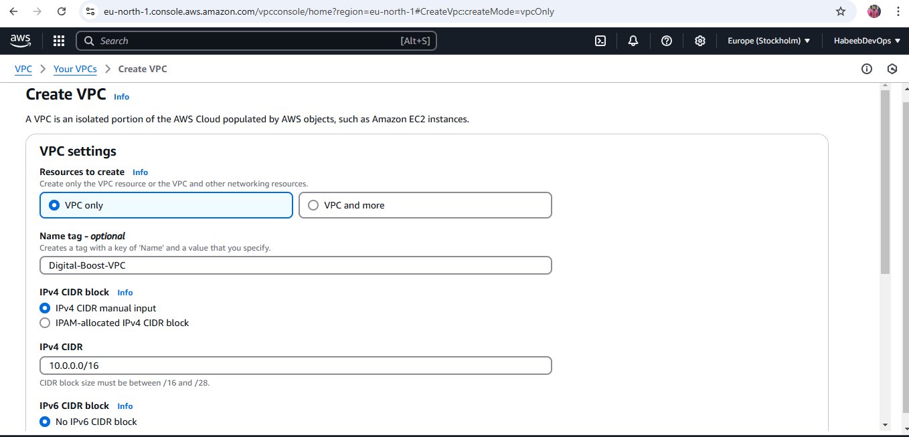

- Create VPC with public subnet
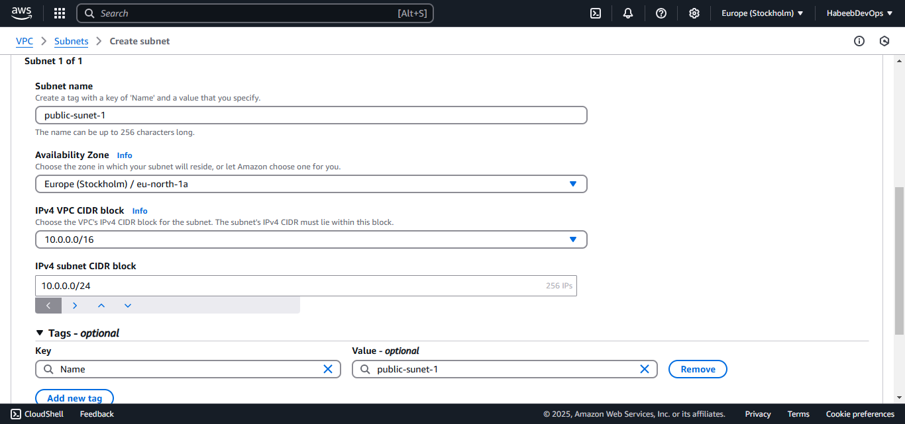

- Create private subnet
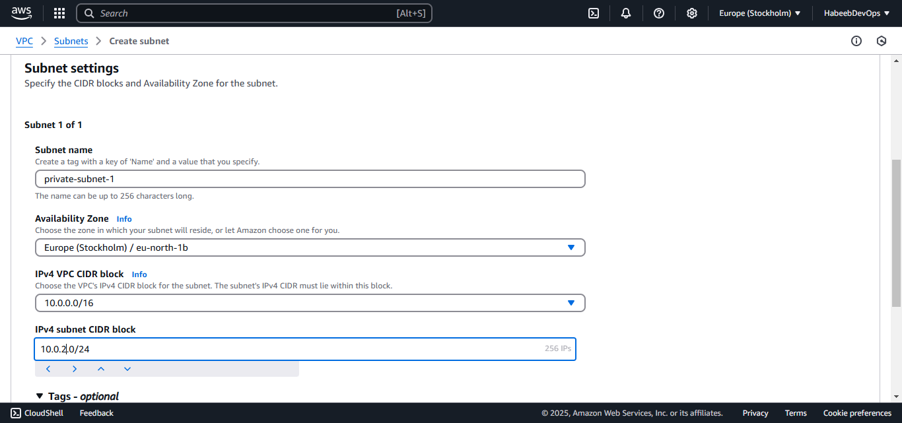

- Create public route table
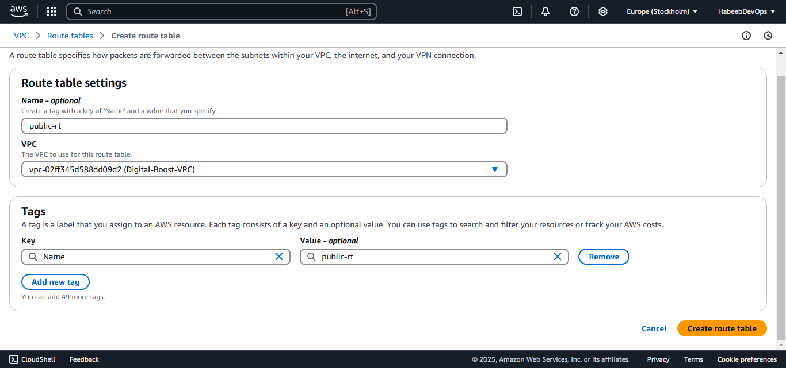

- Public route table association
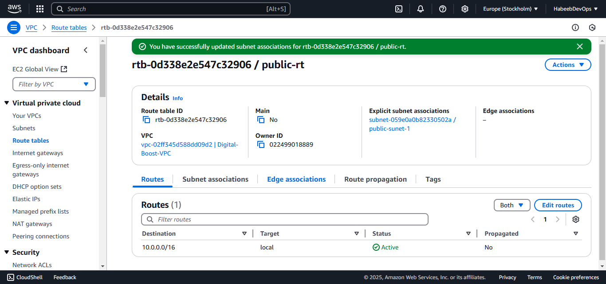

- Create private route table
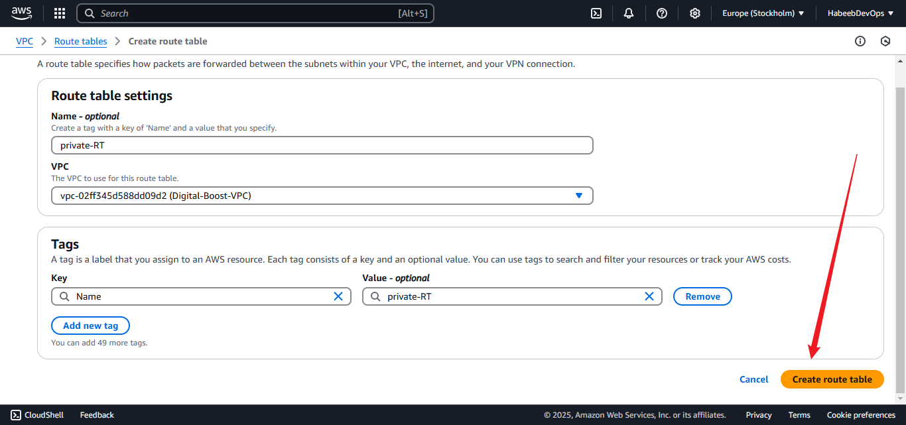

- Private route table association
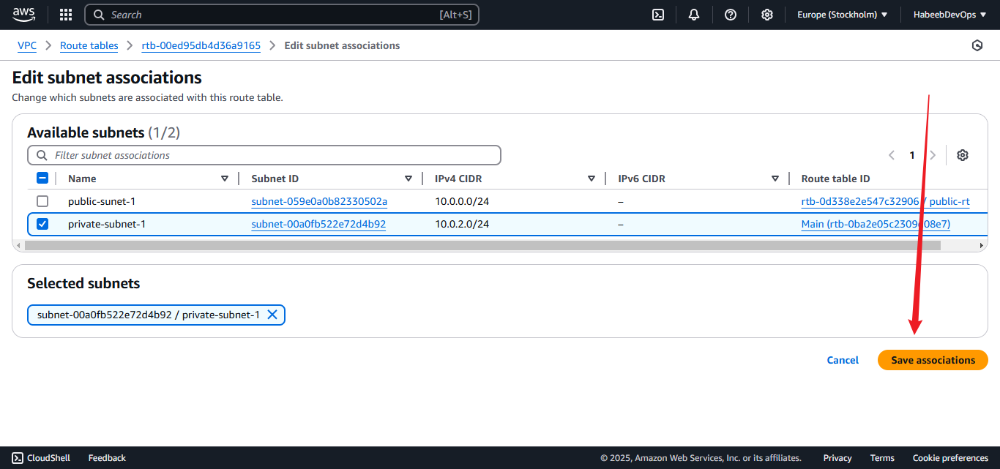

- Create internet gateway
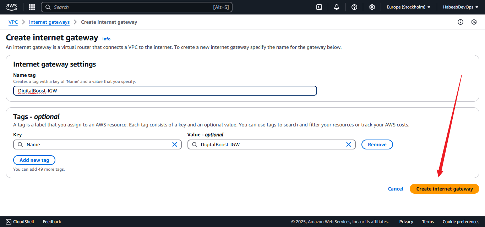

- Attach internet gateway to VPC
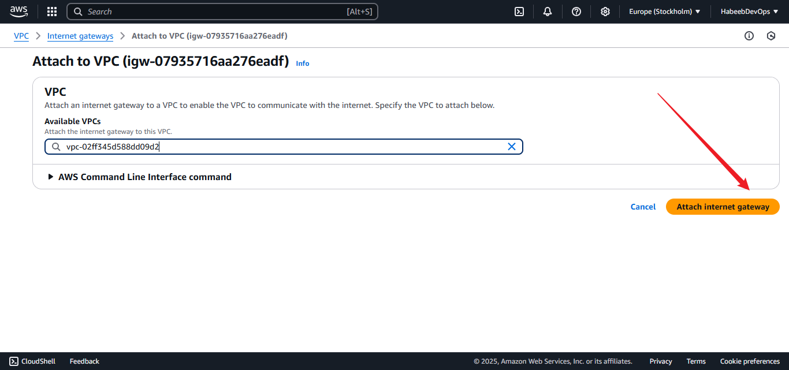

- Add route for public subnet
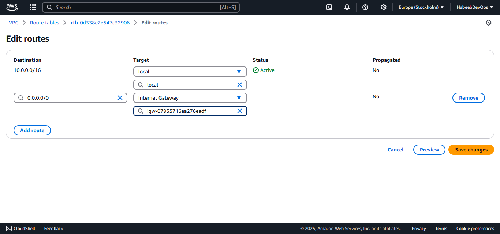

- Create NAT gateway
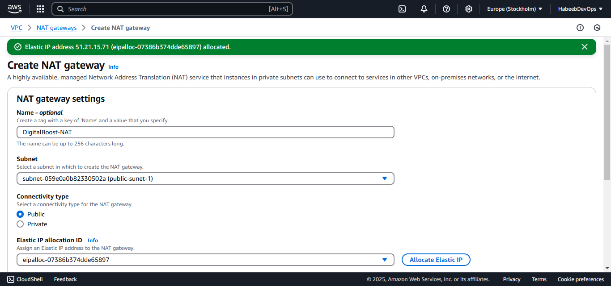

- Add route for private subnet

- Create EFS
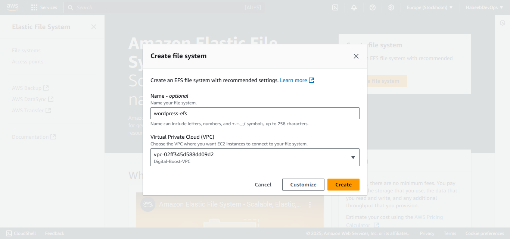
